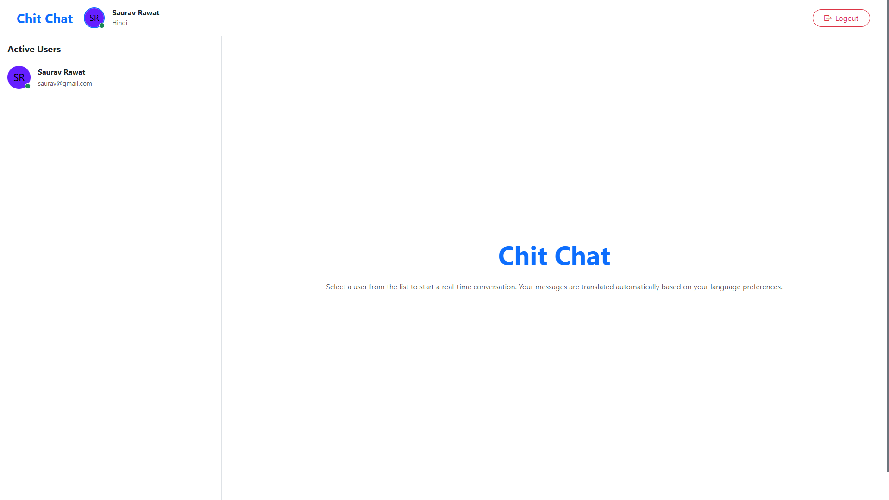
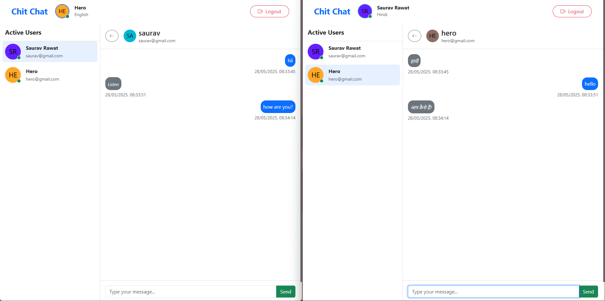

# ChitChat

ChitChat is a React app that translates text messages into different languages instantly. It supports real-time text-to-text translation in a chat application.



## Features

- Text-to-text conversion
- Real-time translation
- Easy-to-use interface
- Supports multiple languages



## Setup

### Prerequisites

- [Node.js](https://nodejs.org/)
- [npm](https://www.npmjs.com/)
- [Python](https://www.python.org/downloads/)

### Installation

1. Clone the repository:

   ```sh
   git clone https://github.com/SauRavRwT/ChitChat.git
   cd ChitChat
   ```

2. Install dependencies:
   ```sh
   npm install
   ```
3. **Set Up Firebase**:
   - Go to the [Firebase Console](https://console.firebase.google.com/) and create a new project.
      - Register a web app within your Firebase project.
      - Enable Firebase Authentication and set up the desired sign-in methods.
      - Copy the Firebase configuration and create a `firebase.js` file in the project directory:

        ```javascript
        // firebase.js
        export const firebaseConfig = {
          apiKey: "your_api_key",
          authDomain: "your_auth_domain",
          databaseURL: "your_database_url",
          projectId: "your_project_id",
          storageBucket: "your_storage_bucket",
          messagingSenderId: "your_messaging_sender_id",
          appId: "your_app_id"
        };
        ```


### Scripts

- `npm start`: Runs the app in development mode at [http://localhost:3000](http://localhost:3000).
- `npm test`: Runs tests.
- `npm run build`: Builds the app for production.
- `npm run eject`: Ejects the build configuration.

## Server Setup

We are using a local server with Python. Follow these steps for installation:

> **Note:** If you are using Windows, use the default terminal (Command Prompt). For Debian/RedHat/Fedora, use any terminal.

1. Create a Python virtual environment:

   ```bash
   mkdir venv  # Create directory
   python -m venv venv  # Create virtual environment
   ```

2. Activate the virtual environment:

   ```bash
   source venv/bin/activate  # For Linux/Mac
   venv\Scripts\activate  # For Windows
   ```

3. Install Python dependencies:

   ```bash
   pip install -r requirements.txt
   pip install --upgrade torch transformers
   ```

4. Run your Python file:

   ```bash
   python App.py
   ```

You are now ready to use the server!

## Connecting React to Local Server

In the project you will see a `env.example` file, create a new file named `.env` and copy contents of `env.example` into it. In that file, you will see the following environment variables

```env
REACT_APP_BACKEND_URL=http://YOUR_IP_ADDRESS:8080
```

Note: Want to know your ip address? Type command `ipconfig` in terminal

## Contributors

-  [Ravi kumar thakur](https://github.com/Ravithakurofficial)
-  [Ravita Upadhyay](https://github.com/ravitaupadhyay)

## License

This project is licensed under the MIT License. See the [LICENSE](https://github.com/SauRavRwT/ChitChat/blob/master/LICENSE) file for details.
